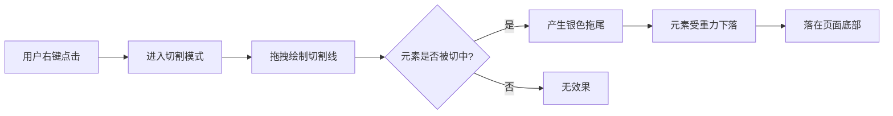

## 1. Product Overview
实现一个趣味网页交互效果，用户可通过鼠标右键切割网页元素，被切割的元素会产生银色拖尾效果并受重力影响下落至页面底部。

## 2. Core Features

### 2.1 Feature Module
1. **切割交互**: 鼠标右键点击/拖拽切割网页元素
2. **拖尾效果**: 切割轨迹显示银色拖尾
3. **重力系统**: 被切割的元素受重力影响下落

### 2.2 Page Details
| Page Name | Module Name | Feature description |
|-----------|-------------|---------------------|
| Demo page | Interactive demo | 展示切割效果的演示页面，包含各种可切割的网页元素 |

## 3. Core Process
用户右键点击网页 → 开始切割模式 → 拖拽鼠标绘制切割线 → 元素被切割 → 产生银色拖尾 → 被切割部分受重力下落 → 落在页面底部

## 4. User Interface Design

### 4.1 Design Style
- 切割轨迹: 银色渐变，带发光效果
- 拖尾: 银色透明渐变，逐渐消失
- 下落元素: 保持原有样式，添加旋转和阴影效果
- 背景: 深色渐变，突出切割效果

### 4.2 Page Design Overview
| Page Name | Module Name | UI Elements |
|-----------|-------------|-------------|
| Demo page | Hero section | 标题、切割说明、示例元素 |
| Demo page | Interactive area | 可切割的卡片、图片、文字元素 |

### 4.3 Responsiveness
- 桌面端: 完整切割功能
- 移动端: 支持触摸切割