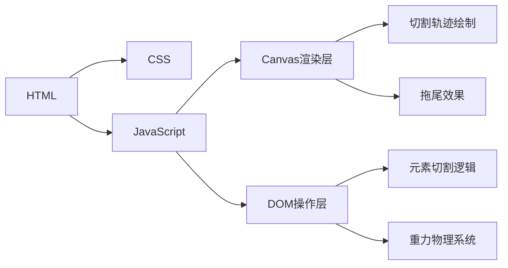

## 1. Architecture Design

## 2. Technology Description

* Frontend: React\@18 + tailwindcss\@3 + vite

* Initialization Tool: vite-init

* Backend: None

* Canvas API: 用于绘制切割轨迹和拖尾效果

## 3. Route Definitions

| Route | Purpose     |
| ----- | ----------- |
| /     | 主页，展示切割效果演示 |

## 4. Core Components

### 4.1 CutCanvas Component

* 负责绘制切割轨迹和银色拖尾

* 监听鼠标/触摸事件

### 4.2 GravityElement Component

* 被切割元素的物理模拟

* 重力加速度、旋转、碰撞检测

### 4.3 CutController Hook

* 切割状态管理

* 切割逻辑处理

## 5. Implementation Details

### 5.1 切割算法

1. 检测鼠标轨迹与DOM元素的交集
2. 使用Canvas绘制切割路径
3. 将被切割元素复制为两个独立元素
4. 对下半部分元素应用重力

### 5.2 银色拖尾效果

* 使用Canvas的globalCompositeOperation实现渐变拖尾

* 拖尾颜色: silver (#C0C0C0) 到 transparent

* 拖尾长度与鼠标速度相关

### 5.3 重力系统

* 使用requestAnimationFrame更新位置

* 重力加速度: 9.8m/s² (模拟值)

* 边界检测: 元素落地后停止运动

